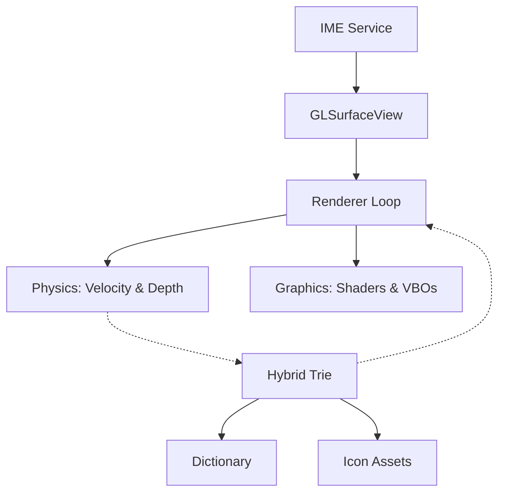

# Z-Type: Project Genesis
## The "Infinite Hallway" Keyboard

This document is the master architectural plan for **Z-Type**. It is written for a developer who has zero previous context but needs to deliver a "super cool, flashy, and insanely powerful" experience.

---

### 1. The Core Vision
Z-Type is not a keyboard; it is a **high-speed flight simulator for ideas**. 
- **The Interface**: A 3D infinite tunnel.
- **The Engine**: OpenGL ES 3.0 (Game Engine grade).
- **The Input**: Single-finger velocity-based "diving" through alphanumeric and conceptual nodes.
- **The Aesthetic**: Cyber-Luminescent (Neon, Glow, Fluidity).

---

### 2. Design Constraints (Non-Negotiable)
- **60 FPS or Death**: If the frame rate drops, the "immersion" breaks. Use GPU shaders for visuals.
- **Natural Pull**: Touch interactions must feel like "steering" a camera, not dragging a 2D object.
- **The Mandelbrot Rule**: New layers of data (children nodes) must emerge from the center of the selected parent node.
- **Opaque Logic, Transparent UI**: The keyboard must be a truly transparent overlay on the Android OS.

---

### 3. Implementation Epochs

#### Epoch 0: The Chassis (Environment & OpenGL)
*Goal: Get a spinning 3D cube rendered inside a transparent Android IME window.*
- **Step 0.1**: Bootstrap an `InputMethodService`. 
- **Step 0.2**: Force Window Transparency. Use `FLAG_LAYOUT_NO_LIMITS` and `adjustPan`. 
- **Step 0.3**: Integrate `GLSurfaceView` with a basic EGL configuration for transparency (`AlphaBits = 8`).
- **Step 0.4**: Implement the "Build & Force-Stop" loop to bypass Android's IME caching.

#### Epoch 1: The Tunnel (3D World & Physics)
*Goal: Move forward through a field of letters.*
- **Step 1.1**: Create a `Camera3D` with a perspective projection matrix.
- **Step 1.2**: Project the A-Z alphabet into a tunnel/cylindrical layout along the Z-axis.
- **Step 1.3**: Map Finger Velocity -> Camera X/Y Rotation and Z-Depth Advance.
- **Step 1.4**: Implement "Recursive Depth": When a layer is passed, reset depth and replace nodes with the next predicted set.

#### Epoch 2: The Brain (Hybrid Concept-Trie)
*Goal: The system knows what you are thinking.*
- **Step 2.1**: Build a Trie that stores `Char` nodes AND `Icon/Concept` nodes.
- **Step 2.2**: Integrate a dictionary provider.
- **Step 2.3**: Map specific words to "Concept Suite" icons (e.g., "Car" -> 🏎️, 🚗, 🚕).
- **Step 2.4**: Real-time prediction: As you dive into 'H', the next layer in the tunnel must immediately populate with 'e', 'a', 'i'.

#### Epoch 3: Interaction & Magnetism
*Goal: Make the selection feel physical.*
- **Step 3.1**: Implement "Linger Detection" (35ms hover = magnetism).
- **Step 3.2**: Visual Attraction: Nodes should "lean" or "rush" toward the finger when they are the focus of velocity.
- **Step 3.3**: Haptic Feedback: Use `VibrationEffect` "ticks" for hover and "thumps" for selection.

#### Epoch 4: The Neon Veil (Visual Polish)
*Goal: Make it "Flashy."*
- **Step 4.1**: Fragment Shaders: Add a glow/bloom to all text.
- **Step 4.2**: Motion Blur: Smear nodes along the Z-axis when velocity is high.
- **Step 4.3**: Particle Trails: Emit "Data Filaments" from selected nodes.
- **Step 4.4**: Theming Engine: Create a system for swapping shader constants (Neon vs. Glass vs. Stealth).

---

### 4. Technical Architecture

### 5. Getting Started (The First 15 Minutes)
1. **Run Prompt 01**: Follow the instructions in `01_foundation_engine.md`.
2. **Run Prompt 02**: Follow the instructions in `02_hybrid_brain.md`.
3. **Run Prompt 03**: Follow the instructions in `03_infinite_hallway_physics.md`.
4. **Run Prompt 04**: Follow the instructions in `04_neon_polish_theming.md`.
5. **Validation**: You are ready for Epoch 1 when you can see your phone's home screen through the keyboard area and a 3D object is moving fluidly over it.

---
**Focus on the feeling of the "Dive." If the dive feels right, the rest is just details.**
